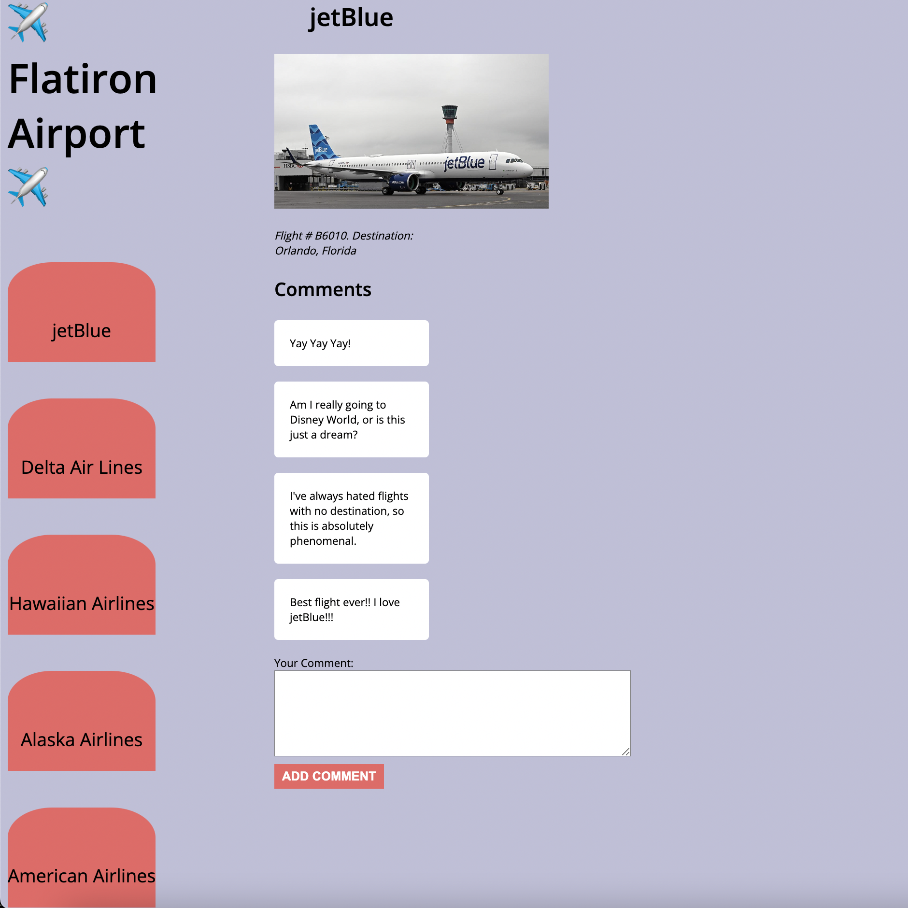

# Flatiron Airport

Today you'll be using a local API to build out the frontend for an app for a new
airport, _Flatiron Airport_! Airline companies submit photos of their airlines,
and viewers submit comments on the airlines.

## Demo

Use this image as an example of how the app should look once it is complete.



> To view in VSCode, right click on the README.md file and select "Open
> Preview".

## Setup

Run this command to get the backend started:

```console
$ json-server --watch db.json
```

Test your server by visiting this route in the browser:

[http://localhost:3000/airlines](http://localhost:3000/airlines)

Then, open the `index.html` file on your browser to run the application.

Write your code in the `src/index.js` file. The base URL for your API will be
[http://localhost:3000](http://localhost:3000).

## Deliverables

As a user, I can:

1. See the first airline's details, including its **name, image, description, and
   comments**, when the page loads. You will need to make a GET request to the
   following endpoint to retrieve the airline data, along with its associated
   comments:

   ```txt
   GET /airlines/1

   Example Response:
    {
      "id": 1,
      "name": "jetBlue",
      "description": "Flight # B6010. Destination: Orlando, Florida",
      "image_url": "https://aviationweek.com/sites/default/files/styles/crop_freeform/public/2021-08/jetblue_jetblue-airways_promo.jpg?itok=Wlkg6lF1",
      "comments": [
        "Yay Yay Yay!",
        "Am I really going to Disney World, or is this just a dream?",
        "I've always hated flights with no destination, so this is absolutely phenomenal.",
        "Best flight ever!! I love jetBlue!!!"
      ]
    }
   ```

2. See a menu of all airlines in the `<nav>` element on the left side of the page
   when the page loads. You will need to make a GET request to the following
   endpoint to retrieve the airline data:

   ```txt
   GET /airlines

   Example response:
   [
    {
      "id": 1,
      "name": "jetBlue",
      "description": "Flight # B6010. Destination: Orlando, Florida",
      "image_url": "https://aviationweek.com/sites/default/files/styles/crop_freeform/public/2021-08/jetblue_jetblue-airways_promo.jpg?itok=Wlkg6lF1",
      "comments": [
        "Yay Yay Yay!",
        "Am I really going to Disney World, or is this just a dream?",
        "I've always hated flights with no destination, so this is absolutely phenomenal.",
        "Best flight ever!! I love jetBlue!!!"
      ]
    },
    {
      "id": 2,
      "name": "Delta Air Lines",
      "description": "Flight # DL121. Destination: Anaheim, California",
      "image_url": "https://encrypted-tbn0.gstatic.com/images?q=tbn:ANd9GcT0vqle3iDBzPWtkF-jLPmgY9610eVlg77LSA&usqp=CAU",
      "comments": [
        "My child's fav airplane!!!",
        "Like a breath of fresh air"
      ]
    }
   ]
   ```

3. Add a new comment to the page when the comment form is submitted. **No
   persistence is needed**.